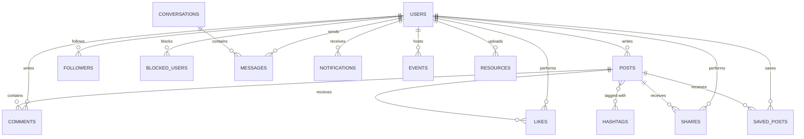

# CampusConnect Database Schema

This document defines the relational database schema of CampusConnect using PostgreSQL.



## Tables

### 1. `users`
Tracks student registration profiles.
```sql
CREATE TABLE users (
    id UUID PRIMARY KEY DEFAULT gen_random_uuid(),
    full_name VARCHAR(100) NOT NULL,
    username VARCHAR(30) UNIQUE NOT NULL,
    email VARCHAR(255) UNIQUE NOT NULL CHECK (email LIKE '%@%.edu' OR email LIKE '%@%.edu.%'),
    password_hash VARCHAR(255) NOT NULL,
    role VARCHAR(20) DEFAULT 'student' CHECK (role IN ('student', 'moderator', 'admin')),
    department VARCHAR(100),
    academic_year VARCHAR(20) CHECK (academic_year IN ('Freshman', 'Sophomore', 'Junior', 'Senior', 'Graduate', 'Alumni')),
    profile_picture_url VARCHAR(2083),
    bio TEXT,
    is_verified BOOLEAN DEFAULT FALSE,
    refresh_token VARCHAR(512),
    created_at TIMESTAMP WITH TIME ZONE DEFAULT CURRENT_TIMESTAMP,
    updated_at TIMESTAMP WITH TIME ZONE DEFAULT CURRENT_TIMESTAMP
);
```

### 2. `posts`
Represents feeds posts.
```sql
CREATE TABLE posts (
    id UUID PRIMARY KEY DEFAULT gen_random_uuid(),
    user_id UUID NOT NULL REFERENCES users(id) ON DELETE CASCADE,
    content TEXT,
    media_url VARCHAR(2083),
    media_type VARCHAR(20) CHECK (media_type IN ('image', 'video', 'document')),
    created_at TIMESTAMP WITH TIME ZONE DEFAULT CURRENT_TIMESTAMP,
    updated_at TIMESTAMP WITH TIME ZONE DEFAULT CURRENT_TIMESTAMP
);
```

### 3. `hashtags`
Used for searching and trending topics.
```sql
CREATE TABLE hashtags (
    id UUID PRIMARY KEY DEFAULT gen_random_uuid(),
    name VARCHAR(50) UNIQUE NOT NULL,
    created_at TIMESTAMP WITH TIME ZONE DEFAULT CURRENT_TIMESTAMP
);

-- Join table for Post-Hashtag relation
CREATE TABLE post_hashtags (
    post_id UUID REFERENCES posts(id) ON DELETE CASCADE,
    hashtag_id UUID REFERENCES hashtags(id) ON DELETE CASCADE,
    PRIMARY KEY (post_id, hashtag_id)
);
```

### 4. `comments`
Comments written on posts.
```sql
CREATE TABLE comments (
    id UUID PRIMARY KEY DEFAULT gen_random_uuid(),
    post_id UUID NOT NULL REFERENCES posts(id) ON DELETE CASCADE,
    user_id UUID NOT NULL REFERENCES users(id) ON DELETE CASCADE,
    parent_comment_id UUID REFERENCES comments(id) ON DELETE CASCADE, -- Supports threaded nested comments
    content TEXT NOT NULL,
    created_at TIMESTAMP WITH TIME ZONE DEFAULT CURRENT_TIMESTAMP,
    updated_at TIMESTAMP WITH TIME ZONE DEFAULT CURRENT_TIMESTAMP
);
```

### 5. `likes`
Tracks post reactions.
```sql
CREATE TABLE likes (
    id UUID PRIMARY KEY DEFAULT gen_random_uuid(),
    post_id UUID NOT NULL REFERENCES posts(id) ON DELETE CASCADE,
    user_id UUID NOT NULL REFERENCES users(id) ON DELETE CASCADE,
    created_at TIMESTAMP WITH TIME ZONE DEFAULT CURRENT_TIMESTAMP,
    CONSTRAINT unique_post_user_like UNIQUE (post_id, user_id)
);
```

### 6. `saved_posts`
Bookmarks created by users.
```sql
CREATE TABLE saved_posts (
    id UUID PRIMARY KEY DEFAULT gen_random_uuid(),
    user_id UUID NOT NULL REFERENCES users(id) ON DELETE CASCADE,
    post_id UUID NOT NULL REFERENCES posts(id) ON DELETE CASCADE,
    created_at TIMESTAMP WITH TIME ZONE DEFAULT CURRENT_TIMESTAMP,
    CONSTRAINT unique_user_saved_post UNIQUE (user_id, post_id)
);
```

### 7. `shares`
Tracks when post links/contents are shared inside or outside the platform.
```sql
CREATE TABLE shares (
    id UUID PRIMARY KEY DEFAULT gen_random_uuid(),
    user_id UUID NOT NULL REFERENCES users(id) ON DELETE CASCADE,
    post_id UUID NOT NULL REFERENCES posts(id) ON DELETE CASCADE,
    platform VARCHAR(50) DEFAULT 'internal', -- e.g., 'internal', 'whatsapp', 'twitter'
    created_at TIMESTAMP WITH TIME ZONE DEFAULT CURRENT_TIMESTAMP
);
```

### 8. `followers`
Tracks follower relationships.
```sql
CREATE TABLE followers (
    follower_id UUID NOT NULL REFERENCES users(id) ON DELETE CASCADE,
    following_id UUID NOT NULL REFERENCES users(id) ON DELETE CASCADE,
    created_at TIMESTAMP WITH TIME ZONE DEFAULT CURRENT_TIMESTAMP,
    PRIMARY KEY (follower_id, following_id),
    CONSTRAINT self_follow_prevention CHECK (follower_id <> following_id)
);
```

### 9. `conversations`
Chat channel rooms.
```sql
CREATE TABLE conversations (
    id UUID PRIMARY KEY DEFAULT gen_random_uuid(),
    is_group BOOLEAN DEFAULT FALSE,
    group_name VARCHAR(100),
    group_avatar VARCHAR(2083),
    created_at TIMESTAMP WITH TIME ZONE DEFAULT CURRENT_TIMESTAMP,
    updated_at TIMESTAMP WITH TIME ZONE DEFAULT CURRENT_TIMESTAMP
);

-- Join table for participants in a conversation
CREATE TABLE conversation_participants (
    conversation_id UUID REFERENCES conversations(id) ON DELETE CASCADE,
    user_id UUID REFERENCES users(id) ON DELETE CASCADE,
    joined_at TIMESTAMP WITH TIME ZONE DEFAULT CURRENT_TIMESTAMP,
    PRIMARY KEY (conversation_id, user_id)
);
```

### 10. `messages`
Individual chat messages inside a conversation.
```sql
CREATE TABLE messages (
    id UUID PRIMARY KEY DEFAULT gen_random_uuid(),
    conversation_id UUID NOT NULL REFERENCES conversations(id) ON DELETE CASCADE,
    sender_id UUID NOT NULL REFERENCES users(id) ON DELETE CASCADE,
    content TEXT,
    attachment_url VARCHAR(2083),
    attachment_type VARCHAR(20) CHECK (attachment_type IN ('image', 'video', 'audio', 'file')),
    is_read BOOLEAN DEFAULT FALSE,
    created_at TIMESTAMP WITH TIME ZONE DEFAULT CURRENT_TIMESTAMP
);
```

### 11. `notifications`
Direct pushes generated for activities (like, comment, follow, system alerts).
```sql
CREATE TABLE notifications (
    id UUID PRIMARY KEY DEFAULT gen_random_uuid(),
    receiver_id UUID NOT NULL REFERENCES users(id) ON DELETE CASCADE,
    sender_id UUID REFERENCES users(id) ON DELETE SET NULL,
    type VARCHAR(30) NOT NULL, -- e.g., 'like', 'comment', 'follow', 'event_reminder', 'message'
    entity_id UUID, -- References the post_id, comment_id, message_id etc.
    content TEXT NOT NULL,
    is_read BOOLEAN DEFAULT FALSE,
    created_at TIMESTAMP WITH TIME ZONE DEFAULT CURRENT_TIMESTAMP
);
```

### 12. `blocked_users`
Tracks blocking relationships for privacy.
```sql
CREATE TABLE blocked_users (
    blocker_id UUID NOT NULL REFERENCES users(id) ON DELETE CASCADE,
    blocked_id UUID NOT NULL REFERENCES users(id) ON DELETE CASCADE,
    created_at TIMESTAMP WITH TIME ZONE DEFAULT CURRENT_TIMESTAMP,
    PRIMARY KEY (blocker_id, blocked_id),
    CONSTRAINT self_block_prevention CHECK (blocker_id <> blocked_id)
);
```

### 13. `events`
Campus/Collegiate events postings.
```sql
CREATE TABLE events (
    id UUID PRIMARY KEY DEFAULT gen_random_uuid(),
    host_id UUID NOT NULL REFERENCES users(id) ON DELETE CASCADE,
    title VARCHAR(150) NOT NULL,
    description TEXT NOT NULL,
    location VARCHAR(255) NOT NULL, -- e.g., "Innovation Center" or "Room 203"
    event_date TIMESTAMP WITH TIME ZONE NOT NULL,
    banner_url VARCHAR(2083),
    capacity INTEGER,
    created_at TIMESTAMP WITH TIME ZONE DEFAULT CURRENT_TIMESTAMP,
    updated_at TIMESTAMP WITH TIME ZONE DEFAULT CURRENT_TIMESTAMP
);
```

### 14. `resources`
Uploaded academic resources.
```sql
CREATE TABLE resources (
    id UUID PRIMARY KEY DEFAULT gen_random_uuid(),
    uploader_id UUID NOT NULL REFERENCES users(id) ON DELETE CASCADE,
    title VARCHAR(150) NOT NULL,
    description TEXT,
    file_url VARCHAR(2083) NOT NULL,
    file_type VARCHAR(50), -- e.g., 'pdf', 'docx', 'zip'
    course_code VARCHAR(30), -- e.g., 'CS101'
    downloads_count INTEGER DEFAULT 0,
    created_at TIMESTAMP WITH TIME ZONE DEFAULT CURRENT_TIMESTAMP,
    updated_at TIMESTAMP WITH TIME ZONE DEFAULT CURRENT_TIMESTAMP
);
```
